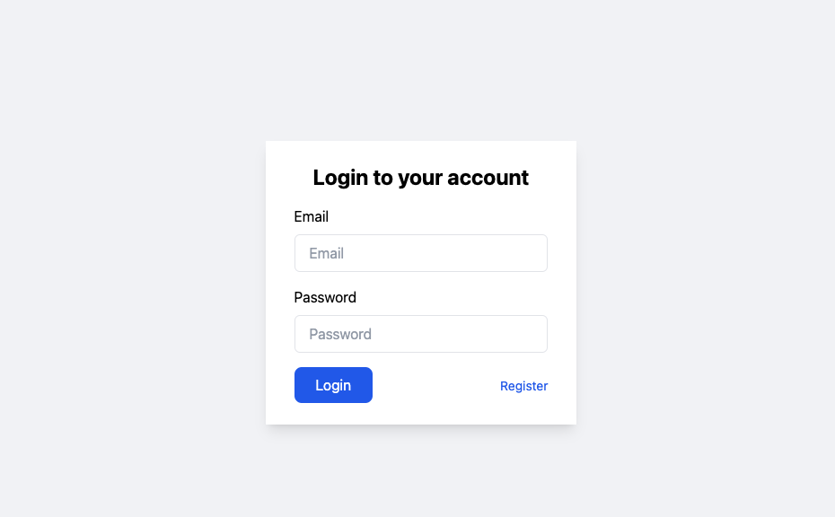
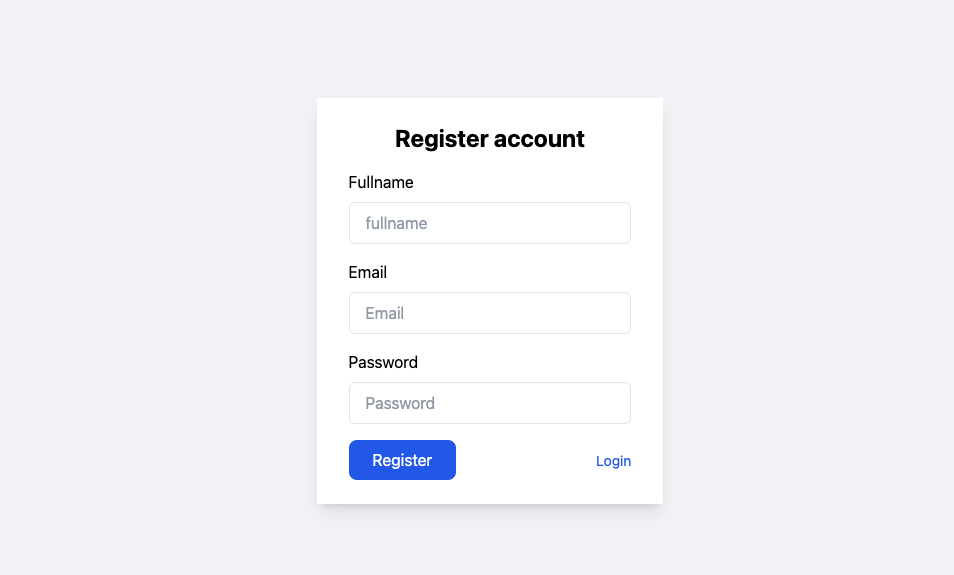
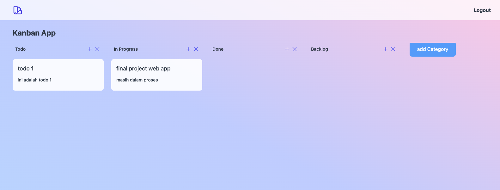
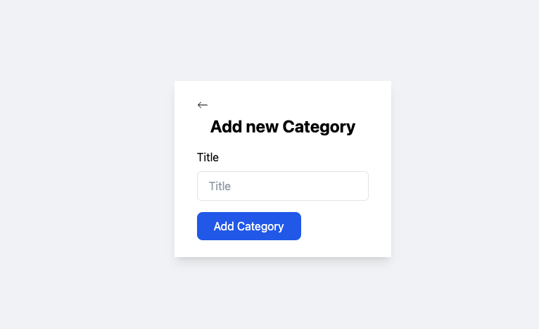
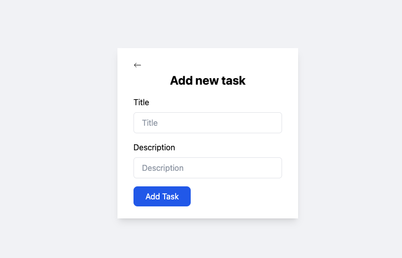
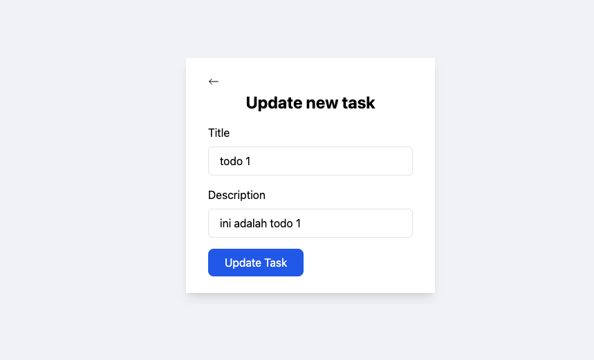

# Week 2

## Client

### Description

Kalian diminta untuk membuat sebuah aplikasi client yang dapat melakukan request ke server (Rest APi) yang sebelumnya sudah kalian buat.

Kalian juga diminta membuat tampilan web **semenarik mungkin** menggunakan tailwindcss.

### Instruction

📁 **handler/web**

- **auth**
  - method `Login`: adalah method handler yang memiliki parameter `http.ResponseWriter` dan `*http.Request` yang akan menangani request ke endpoint `/login` dengan method `GET`
    - method ini akan menampilkan halaman login menggunakan `template.ParseFS` dengan parameter `fs.FS` diisi dengan properti `embed` dari struct `authWeb`
    - Gunakan template html `views/auth/login.html` sebagai tampilan halaman login yang menggunakan template header `views/general/header.html`, kalian dapat menggunakan `path.Join` untuk menggabungkan path
    - Buatlah tampilan halaman login menggunakan html dan tailwindcss sesuai desain kalian. **Pastikan** terdapat `<h1>Login</h1>` sebagai judul halaman login
    - Pastikan terdapat form login yang memiliki action ke endpoint `/login/process` dengan method `POST` dan memiliki input `email` dan `password`

    contoh tampilan:

    

  - method `Register`: adalah method handler yang memiliki parameter `http.ResponseWriter` dan `*http.Request` yang akan menangani request ke endpoint `/register` dengan method `GET`
    - method ini akan menampilkan halaman register menggunakan `template.ParseFS` dengan parameter `fs.FS` diisi dengan properti `embed` dari struct `authWeb`
    - Gunakan template html `views/auth/register.html` sebagai tampilan halaman register yang menggunakan template header `views/general/header.html`, kalian dapat menggunakan `path.Join` untuk menggabungkan path
    - Buatlah tampilan halaman register menggunakan html dan tailwindcss sesuai desain kalian. **Pastikan** terdapat `<h1>Register</h1>` sebagai judul halaman register
    - Pastikan terdapat form register yang memiliki action ke endpoint `/register/process` dengan method `POST` dan memiliki input `fullname`, `email`, `password`.

    contoh tampilan:

    

  - method `Logout`: adalah method handler yang memiliki parameter `http.ResponseWriter` dan `*http.Request` yang akan menangani request ke endpoint `/logout` dengan method `GET`
    - method ini akan menghapus cookie yang berisi `user_id` yang disimpan di browser
    - Setelah proses menghapus cookie berhasil, method ini akan mengarahkan kembali ke halaman login dengan menggunakan `http.Redirect`

- **dashboard**
  - method `Dashboard`: adalah method handler yang memiliki parameter `http.ResponseWriter` dan `*http.Request` yang akan menangani request ke endpoint `/dashboard` dengan method `GET`
    - method ini akan menampilkan halaman dashboard menggunakan `template.ParseFS` dengan parameter `fs.FS` diisi dengan properti `embed` dari struct `dashboardWeb`
    - Gunakan template html `views/main/dashboard.html` sebagai tampilan halaman dashboard yang menggunakan template header `views/general/header.html`, kalian dapat menggunakan `path.Join` untuk menggabungkan path

    - Gunakan data yang didapat dari `categoryClient.GetCategoires` berisi list category dan list task yang harus ditampilkan ke dalam template dashboard.

    - Gunakan juga _custom function_ yang ada di variable `funcMap` ke dalam template dashboard menggunakan `.Funcs()`.

    - Buatlah tampilan halaman dashboard menggunakan html dan tailwindcss sesuai desain kalian. **Pastikan** terdapat `<h1>Kanban App</h1>` sebagai judul halaman dashboard
    - Pastikan terdapat link untuk logout dengan action ke endpoint `/logout` dengan method `POST`

    - Pada tampilan dashboard, pastikan terdapat fitur sebagai berikut:
      - daftar categories
      - Pada setiap categories, terdapat daftar task yang berada di dalam categories tersebut
      - Setiap Categories dapat menambah task baru yang bisa dibuat menggunakan simbol `+` di kanan atas categories yang akan mengarahkan ke endpoint `/task/add` dengan ditambah query URL `?category=<category_id>` yang diisi dengan id dari category yang akan ditambahkan task baru
      - Setiap task yang ada dapat diedit / update dengan mengarahkan ke endpoint `/task/update` dengan ditambah query URL `?task_id=<task_id>` yang diisi dengan id dari task yang akan diedit
      - Setiap task juga dapat dihapus dengan membuat simbol / icon _trash_ (sampah) dengan mengarahkan ke endpoint `/task/delete` dengan ditambah query URL `?task_id=<task_id>` yang diisi dengan id dari task yang akan dihapus
      - User dapat menabah category baru dengan diarahkan ke endpoint `/category/add` dengan method `GET`
      - User dapat menghapus category dengan diarahkan ke endpoint `/category/delete` dengan method `GET` dan ditambah query URL `?category_id=<category_id>` yang diisi dengan id dari category yang akan dihapus. FItur ini akan menghapus juga semua task yang ada di dalam category tersebut

    contoh tampilan:

    

- **modify**
  - method `AddCategory`: adalah method handler yang memiliki parameter `http.ResponseWriter` dan `*http.Request` yang akan menangani request ke endpoint `/add-category` dengan method `GET`
    - method ini akan menampilkan halaman add category menggunakan `template.ParseFS` dengan parameter `fs.FS` diisi dengan properti `embed` dari struct `modifyWeb`
    - Gunakan template html `views/main/add-category.html` sebagai tampilan halaman add category yang menggunakan template header `views/general/header.html`, kalian dapat menggunakan `path.Join` untuk menggabungkan path
    - Buatlah tampilan halaman add category menggunakan html dan tailwindcss sesuai desain kalian. **Pastikan** terdapat `<h3>Add new category</h3>` sebagai judul halaman add category
    - Pastikan terdapat form add category yang memiliki action ke endpoint `/category/create` dengan method `POST` dan memiliki input `type` bertipe `text`

    contoh tampilan:

    

  - method `AddCategoryProcess`: adalah method handler yang memiliki parameter `http.ResponseWriter` dan `*http.Request` yang akan menangani request ke endpoint `/category/create` dengan method `POST`
    - Method ini akan memanggil `categoryClient.AddCategories` untuk membuat category baru, dengan mengembalikan response code dan `error`
      - Jika response code adalah `201` maka method ini akan mengarahkan kembali ke halaman dashboard (`/dashboard`) dengan menggunakan `http.Redirect`
      - Jika response code bukan `201` maka method ini akan mengarahkan kembali ke halaman add category (`/category/add`) dengan menggunakan `http.Redirect`

   - method `AddTask`: adalah method handler yang memiliki parameter `http.ResponseWriter` dan `*http.Request` yang akan menangani request ke endpoint `/add-task` dengan method `GET`
    - method ini akan menampilkan halaman add task menggunakan `template.ParseFS` dengan parameter `fs.FS` diisi dengan properti `embed` dari struct `modifyWeb`
    - Gunakan template html `views/main/add-task.html` sebagai tampilan halaman add task yang menggunakan template header `views/general/header.html`, kalian dapat menggunakan `path.Join` untuk menggabungkan path

    - Gunakan data yang didapat dari Query URL `?category=<category_id>` (variable `catId`) untuk menampilkan category id di dalam template add task.

    - Buatlah tampilan halaman add task menggunakan html dan tailwindcss sesuai desain kalian. **Pastikan** terdapat `<h3>Add new task</h3>` sebagai judul halaman add task
    - Pastikan terdapat form add task yang memiliki action ke endpoint `/task/create` ditambah query URL `?category=<category_id>` yang diisi dengan id dari category yang akan ditambahkan task baru dengan method `POST` dan memiliki input `title` dan `description` betipe `text`

    contoh tampilan:

    

  - method `AddTaskProcess`: adalah method handler yang memiliki parameter `http.ResponseWriter` dan `*http.Request` yang akan menangani request ke endpoint `/task/create` dengan method `POST`
    - Method ini akan memanggil `taskClient.CreateTask` untuk membuat task baru,    dengan mengembalikan response code dan `error`
      - Jika response code adalah `201` maka method ini akan mengarahkan kembali ke halaman dashboard (`/dashboard`) dengan menggunakan `http.Redirect`
    - Jika response code bukan `201` maka method ini akan mengarahkan kembali ke halaman add task (`/task/add?category=<category_id>`) dengan menggunakan `http.Redirect`

  - method `UpdateTask`: adalah method handler yang memiliki parameter `http.ResponseWriter` dan `*http.Request` yang akan menangani request ke endpoint `/update-task` dengan method `GET`
    - method ini akan menampilkan halaman update task menggunakan `template.ParseFS` dengan parameter `fs.FS` diisi dengan properti `embed` dari struct `modifyWeb`
    - Gunakan template html `views/main/update-task.html` sebagai tampilan halaman update task yang menggunakan template header `views/general/header.html`, kalian dapat menggunakan `path.Join` untuk menggabungkan path
    - tampilkan data task yang sudah didapatkan dari `taskClient.GetTaskById` ke dalam template update task.

    contoh tampilan:
    

  - method `DeleteTask`: adalah method handler yang memiliki parameter `http.ResponseWriter` dan `*http.Request` yang akan menangani request ke endpoint `/task/delete` dengan method `GET`
    - Method ini akan memanggil `taskClient.DeleteTask` untuk menghapus task,    dengan mengembalikan response code dan `error`
    - JIka proses penghapusan berhasil maka method ini akan mengarahkan kembali ke halaman dashboard (`/dashboard`) dengan menggunakan `http.Redirect`

  - method `DeleteCategory`: adalah method handler yang memiliki parameter `http.ResponseWriter` dan `*http.Request` yang akan menangani request ke endpoint `/category/delete` dengan method `GET`
    - Method ini akan memanggil `categoryClient.DeleteCategory` untuk menghapus category,    dengan mengembalikan response code dan `error`
    - JIka proses penghapusan berhasil maka method ini akan mengarahkan kembali ke halaman dashboard (`/dashboard`) dengan menggunakan `http.Redirect`

📁 **views**

Setelah melengkapi semua fungsionalitas dari tampilan web sesuai instruksi di atas, kalian diminta untuk mengubah tampilan menjadi lembih menarik dengan menggunakan tailwindcss. Kalian dapat menggunakan tailwindcss secara online atau offline. Jika menggunakan online, kalian dapat menggunakan [tailwindcss playground](https://play.tailwindcss.com/) atau [tailwindcss official website](https://tailwindcss.com/). Jika menggunakan offline, kalian dapat menggunakan [tailwindcss official website](https://tailwindcss.com/) untuk mendownload tailwindcss dan menginstallnya di project kalian.

Penilaian untuk tampilan akan diakumulasikan menjadi 30% dari seluruh penilaian final project ini.
